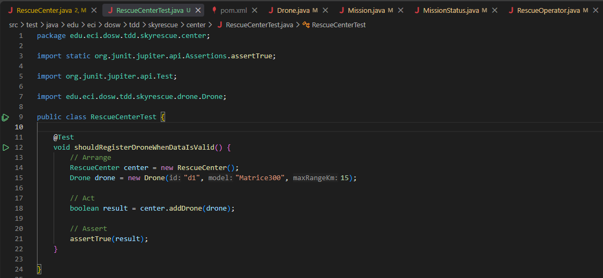
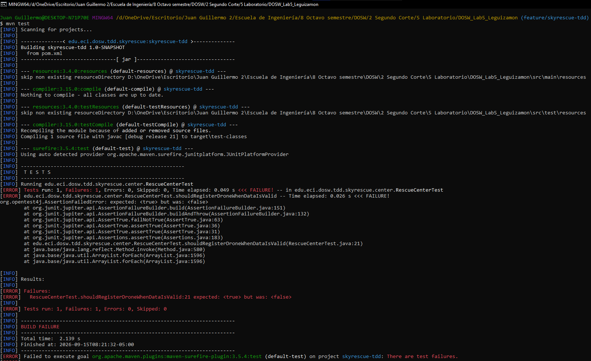
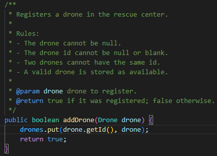
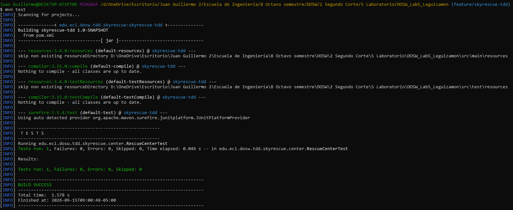
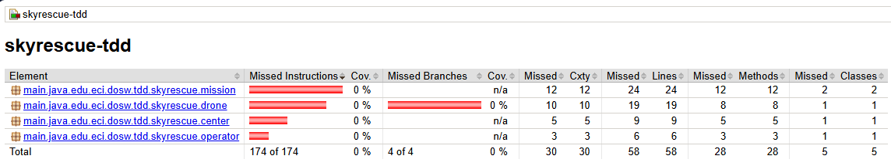
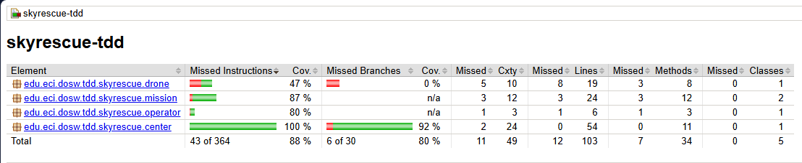
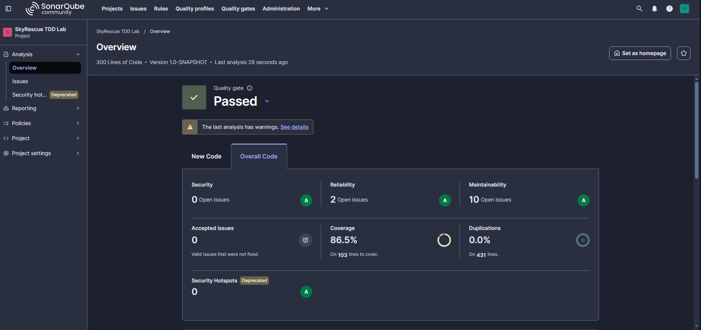

# DOSW_Lab5_Leguizamon

## Integrante

| Nombre | Usuario GitHub | Correo |
| --- | --- | --- |
| JUAN GUILLERMO LEGUIZAMON RODRIGUEZ | Prometeus1439 | juan.leguizamon-r@mail.escuelaing.edu.co |

### Ciclo TDD - registro de dron

**RED:** prueba que demuestra que un dron válido debe registrarse correctamente.

**GREEN:** implementación mínima que hace pasar la prueba.

**REFACTOR:** no fue necesario refactorizar en este ciclo, ya que la implementación
mínima ya era lo bastante clara y sin necesidad de duplicar el código.

## Evidencia de cobertura

### Primera ejecución

### Cobertura final

## Evidencia de SonarQube

Quality Gate: **Passed**

- Security: A (0 issues)
- Reliability: A (2 issues)
- Maintainability: A (10 issues)
- Coverage: 86.5%
- Duplications: 0.0%

## Pull Requests

- PR JUnit: https://github.com/Prometeus1439/DOSW_Lab5_Leguizamon/pull/1
- PR clases base: https://github.com/Prometeus1439/DOSW_Lab5_Leguizamon/pull/2
- PR TDD addDrone: https://github.com/Prometeus1439/DOSW_Lab5_Leguizamon/pull/3
- PR TDD assignMission: https://github.com/Prometeus1439/DOSW_Lab5_Leguizamon/pull/4
- PR TDD completeMission: https://github.com/Prometeus1439/DOSW_Lab5_Leguizamon/pull/5
- PR JaCoCo: https://github.com/Prometeus1439/DOSW_Lab5_Leguizamon/pull/6
- PR SonarQube: #7